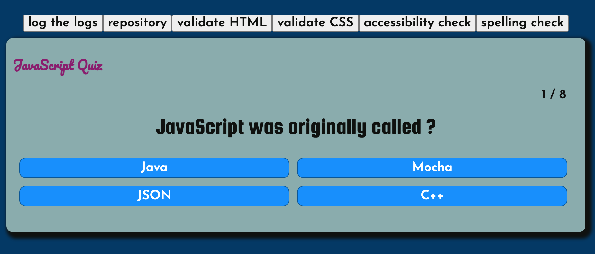

# The Group Project

The goal of the project is to combine everything you have learned into a practical example to show you what you can already do with the knowledge you have! We also want to introduce you to working in a team and will provide you with a mentor that will guide you through this process. In the end it will be a variation of something like the following (a project made by the students of class 31):

[](https://88kiwan.github.io/quiz_app/index.html)

## The plan

The projects starts on the Sunday of week 2. On Sunday, you will be divided into your groups and connected to a mentor who will explain the beginning codebase and how you are going to be working together. For the next week (until the Sunday of week 3) you will get to feel like a developer who is building features for a new website! There will be standups with your group, you will be looking at each others' code and you will be helping each other build as cool a version as you can! At the end you will be demoing your application to the others and you can ask each other how certain features were implemented. On the last few days you can then adjust your code based on feedback and prepare for the technical interview where we will be asking you about the code. These kinds of interviews are very similar to what you will encounter when you start looking for a job so it is a good time to already start practicing.

To make it nice and visual this is the schedule:


## The project repository
You can have a look at the base project repository over [here](https://github.com/HackYourFuture/browser-quiz-project-starter). Your mentor will (either himself, or ask one of you) to be cloning this repository to provide the space that your team will be combining code. There is a base folder structure as well as website given, but feel free to change anything you want. This is your group's project and you can adjust it to your liking!

### The folder structure
A question we get a lot is `is there a standard folder structure?` or `is this the way all projects are organised?` and the answer to both is no. There is no best way to organise code and this comes down to the project as well as the framework(s) you are using. The thing to keep in mind is why we split files into folders. There is a great answer to this question by Max Fisher [here](https://www.quora.com/Why-do-you-want-to-split-your-program-code-into-multiple-files) that says:

>It is basic organisation. Imagine a library would glue every new book to a stack of the old ones. Lord of the Rings would turn from a door stopper to a door. After defeating Sauron, the reader would smoothly transition to The Little Mermaid, before plunging into 50 Shades of Grey.

>Small files are easier to stomach. If every file serves only one topic, you know quickly where to look. You also immediately know what does not belong to the topic, without having to read through commentary.

>Multiple files allow for non-linear organisation. The building blocks of a program rarely follow a single, linear chain of interactions. Loosely coupled components are easily represented by individual files, and folders allow to add external structure.

>Distinct files are easier to reorganise. As complexity grows, components move to sub packages, and sometimes you just need to clean up. A file can simply be moved as a whole. Copy/Pasting to migrate code is more work, especially if you have tacked on all the structuring manually.

>Individual files are easier to track. Code is ideally in a version control system. Knowing that backend/datastore/fileio.cpp changed is already quite informative, and lets you know whether the change is relevant for you. If everything is a single file, you get line 254–378 in app.cpp changed, and have to look up the context yourself.

Basically, a single file is easy to write. Multiple files are much easy to read, maintain and manage. For software development, the later is much more important. Even if you are working alone, future-you does not know everything that past-you has done.
```

This also means that the folder structure can change as your application changes, as long as you keep the basic principles in mind: you want to separate code into logical parts and similarly want to separate your files into logical folders so that it helps you identify what each file is responsible for. This will make bigger code bases more manageable for teams as well as your future self.

Having explained that, the readme in the project repo explains the initial folder [structure](https://github.com/HackYourFuture/browser-quiz-project-starter#structure) this application is using. If you as a group want to reorganise it, that is also fine, as long as you can explain the logic behind it!

### The features
In the project repository there is also a [backlog](https://github.com/HackYourFuture/browser-quiz-project-starter#backlog). See this as a guide to what user stories you can do, but you as a group can determine what you want to work on.

## The presentation
On the last Sunday every group will present their project to the others. The presentation should be a maximum of 15 minutes in which you do the following:

- Demo the application, showing all the features you built
- Go through the code base, explain the files you made and what does what
- Highlight one feature and explain how that feature was implemented

The rest of the group, including the mentors will give your team feedback on your application and your code. Write these things down, as you will be fixing that in the 2 days after the presentation.

## The interview
At the end of the module you will have a mock tech interview as the test for this module. The structure of these interviews are generally as follows:

- You will be asked to share your screen and demo the project. Make it short, only a couple of minutes.
- We will ask you to take a look at the code and explain the folder structure of the project (everything in the 'src' folder)
- We will then ask you what features you helped build.
- One of these features will be picked and we will ask you to explain how you implemented it by walking through the code.
- On the way we will ask you about certain lines of code. Questions like: 'What does this line do?', 'What would happen if I removed this line/piece of code?', 'Why did you use a switch statement here?', etc.
- In the end we will pick a feature that your group did not implement and ask you to broadly explain what needs to be done to implement that feature.

To prepare yourself best, here are some tips:
- Practice the demonstration of your project, make sure it is short and concise
- Be able to share your screen and have your project open locally
- Go through the code of the features you built and make sure you understand what it is doing
- Look at the other features in the project repository and get an idea of what is needed to implement them
