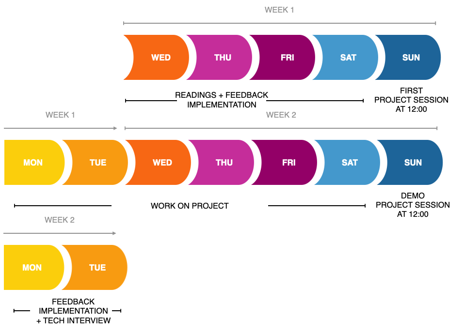

# Project mentor role

First of all, thanks for volunteering your time! 

This primer should help you get to know where we expect students to be at this point and what is expected from you as a mentor. You can see the project description in the [PROJECT file](./PROJECT.md) which the students will read.

## Schedule
This is the schedule of the project (it starts on the Sunday of the second week):

### Pre-start
Before the first sunday there is one thing to do and that is set up a repository for your group to work on. The starter repository is [here](https://github.com/HackYourFuture/browser-quiz-project-starter), but feel free to adjust if you want. Just make sure to explain any changes you have made. If you feel very ambitious you can also make your own repository to make something completely different. The goal of this group exercise is to learn about working in a group as well as use DOM manipulation to make an interactive website. As long as the project does that, it fits into what can be done here.

### First sunday
On the first sunday we will divide the class into the groups and you will have your own room with your group. This is the time to do the following:

- go through the starter repository to explain code structure. This is their first time writing JavaScript multiple files so explain why we do this for bigger projects. There is a basic implementation of questions and being able to click through them you can use as an example.
- show a single PR lifecycle on how code gets into the master branch. The students will know about PR's from their homework and will have read about Agile, but I think it is nice to have a demo of it. We suggest some css changes to make the quiz look a little better.
- explain to your team how the upcoming week is going to work. We want them to have a daily standup meeting to get to know how that works, but this can also be done via slack messages if that is easier for you. Make sure you let your group know how you would like to have questions for you to be sent (in the slack channel? Grouped and given in a daily meeting?). Whatever works for you.
- look through the list of features and discuss them with the team to prioritize them. You will be playing Product Owner, Scrum master and Tech lead in this project.
- Divide the team into smaller groups (probably 2 groups of 2) and give them their first feature. If you have time, you may want to do one feature together with them to get an idea how it all works.
- And most importantly! Think of a team name and let Tjebbe or Rob know so they can create a nice slack channel for you to communicate in!

### During the week
There are a couple things we would like you to do during the week:

- Be available for questions and check in with your group. A week is not a lot of time and we have noticed some are not comfortable yet to ask for help so a quick 'How is it going guys?' every now and then to see what is happening will help move things along.
- Have a look at the PRs and code review them. Once approved you can merge it into the main branch!

### Second Sunday
On the second Sunday we want to get together with the whole class and show off the projects that were made. Decide amongst the group who will present the project to the other groups. This is both a demo of the application as well as going through the code for one feature.

As a mentor on this day we would like you to provide feedback to the other groups and what they built.